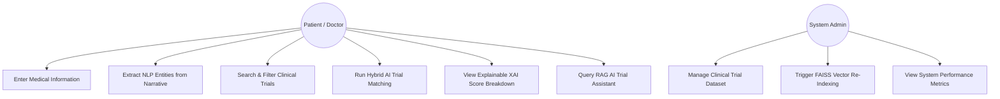
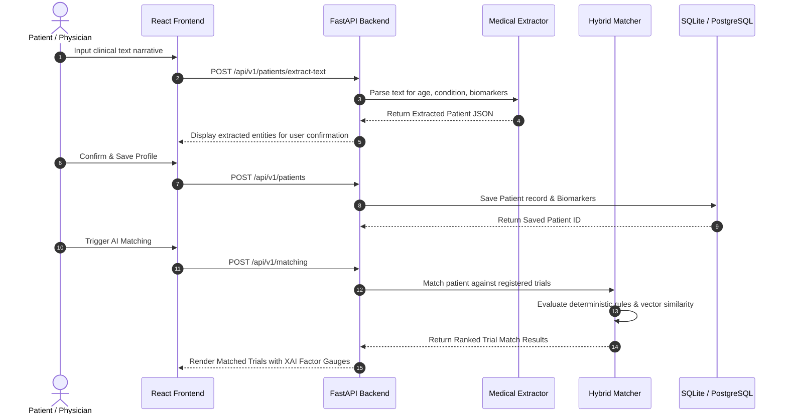

# Use Case & Sequence Diagrams

## 1. Use Case Diagram (Mermaid)

```mermaid
graph TD
    User((Patient / Doctor)) --> UC1[Enter Medical Information]
    User --> UC2[Extract NLP Entities from Narrative]
    User --> UC3[Search & Filter Clinical Trials]
    User --> UC4[Run Hybrid AI Trial Matching]
    User --> UC5[View Explainable XAI Score Breakdown]
    User --> UC6[Query RAG AI Trial Assistant]

    Admin((System Admin)) --> UC7[Manage Clinical Trial Dataset]
    Admin --> UC8[Trigger FAISS Vector Re-Indexing]
    Admin --> UC9[View System Performance Metrics]
```

## 2. Sequence Diagram: Patient Matching Flow

```mermaid
sequenceDiagram
    autonumber
    actor User as Patient / Physician
    participant UI as React Frontend
    participant API as FastAPI Backend
    participant NLP as Medical Extractor
    participant Engine as Hybrid Matcher
    participant DB as SQLite / PostgreSQL

    User->>UI: Input clinical text narrative
    UI->>API: POST /api/v1/patients/extract-text
    API->>NLP: Parse text for age, condition, biomarkers
    NLP-->>API: Return Extracted Patient JSON
    API-->>UI: Display extracted entities for user confirmation
    User->>UI: Confirm & Save Profile
    UI->>API: POST /api/v1/patients
    API->>DB: Save Patient record & Biomarkers
    DB-->>API: Return Saved Patient ID
    User->>UI: Trigger AI Matching
    UI->>API: POST /api/v1/matching
    API->>Engine: Match patient against registered trials
    Engine->>Engine: Evaluate deterministic rules & vector similarity
    Engine-->>API: Return Ranked Trial Match Results
    API-->>UI: Render Matched Trials with XAI Factor Gauges
```
